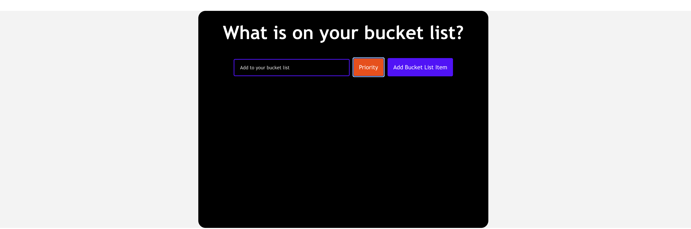
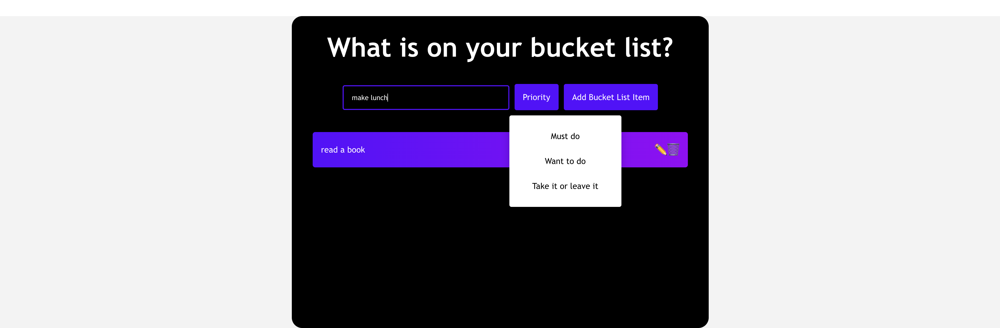
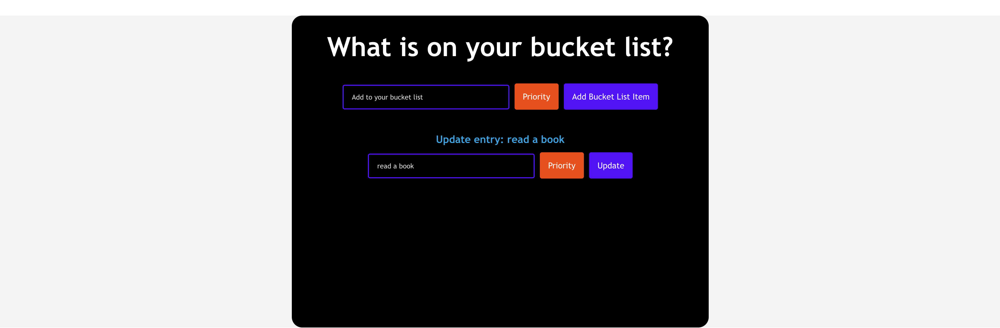
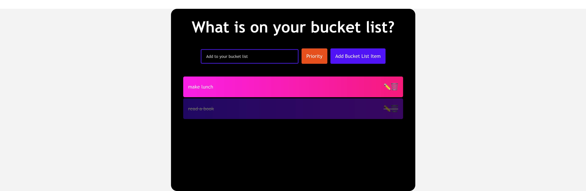

# Bucket List - React

## Description

This is a personal bucket list with ReactJS. Users can pass data as props to the app, then render a list of bucket-list items.

## Table of Contents

- [Installation](#installation)
- [Usage](#usage)
- [License](#license)
- [Contribution](#contribution)
- [Test](#test)
- [Further Questions](#furtherquestions)

## Installation

for local installtion:

Open the directory from VS Code.

1. go to the db directory

2. run $npm install to install packages.

3. run the app $npm run start.

4. use localhost:3000 as the URL to run the app.

for online user:
1. simply open this link to use:
https://65c503cab252ee36cbb91c95--calm-babka-22a32a.netlify.app/

## Usage

1. Users can add a bucket-list item by clicking Add Bucket List Item.

  

2. Users can select item's priority (Must do/Want to do/Take it or leave it) by clicking Priority.

  

3. Users can mark a bucket-list item as complete or incomplete by clicking the item.

  

4. Users can remove a bucket-list item from the list by clicking the icon of bin.

5. Users can update a bucket-list item by clicking the icon of pencil.

  

## License

N/A

## Contribution
You can contribute to this application by revising the codes here:  
https://github.com/PennyPenny76/wk20miniproject
## Test
N/A

## FurtherQuestions

please review the codes here：  
https://github.com/PennyPenny76/wk20miniproject
or contact the owner via: pengyingtong@hotmail.com

## Badges

